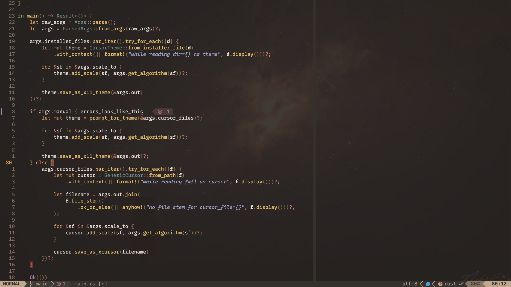

# nvim-config

My [Neovim](https://github.com/neovim/neovim) config that I try
to keep this quite minimal. If you want to use this, simply clone
this repository into your config path (usually `~/.config/nvim/`).

I've also documented what I've done to try and reduce
startup times in [PERFORMANCE.md](./PERFORMANCE.md).

Loosely based off of [kickstart.nvim](https://github.com/nvim-lua/kickstart.nvim).

# Setup

Some general info about my config:

- Pretty opinionated, I'd say
- Uses the native [`vim.pack`](https://neovim.io/doc/user/pack/#_plugin-manager) plugin manager
- Intended for the latest nightly Neovim release
  - Enables [UI2](https://neovim.io/doc/user/lua/#_ui2) for a better experience with `cmdheight=0`
  - Plugins are loaded faster with [`vim.loader`](https://neovim.io/doc/user/lua/#vim.loader)
- Targets writing in Rust, C++, C, Lua, Python and Bash

## Modules

- `colorschemes`: a bunch of colorschemes I like
- `lsp-setup`: sets up certain plugins for LSP support
- `neovide`: specific options for Neovide
- `unconfigured-plugins`: plugins that solely use defaults

## Plugins

Includes any plugin installed in [Modules](#modules) except `colorschemes`.

- `blink.cmp`: fast completions with LSP support and much more
- `conform`: sets up formatting via LSPs or formatters
- `cord`: sets a configurable discord status (via rpc)
- `dial.nvim`: for extending \<C-a\>/\<C-x\> functionality
- `gitsigns.nvim`: allows better control of git hunks
- `lualine`: shows a prettier and easy-to-configure statusline
- `mason-tool-installer.nvim`: ensures certain mason tools are installed
- `mason.nvim`: allows easier installation of LSPs, DAPS, etc
- `mini.surround`: adds the `s`urround operator (e.g,. `sr"'`: `"hi" -> 'hi'`)
- `nvim-autopairs`: pairs and also allows custom pairing rules
- `nvim-lspconfig`: provides default configs for LSPs
- `nvim-treesitter-endwise`: pairs that trigger on \<CR\>, e.g., for `if` statements
- `nvim-treesitter`: treesitter is treesitter
- `rustaceanvim`: sets up rust integrations
- `scrollEOF.nvim`: pads buffer so scrolloff stays consistent near EOF
- `tiny-glimmer.nvim`: shows animations on yank, put, undo, redo
- `tiny-inline-diagnostic.nvim`: diagnostic virtual text, but prettier
- `todo-comments.nvim`: highlights comments such as `TODO: …`, `FIX: …`, etc.
- `vim-fugitive`: improves git experience with `:Git` (over `:!git`)

# Showcase

Neovide, 20% transparency, [Melange theme](https://github.com/savq/melange-nvim), a
custom Recursive build and [this wallpaper](https://www.pixiv.net/en/artworks/144240521).

